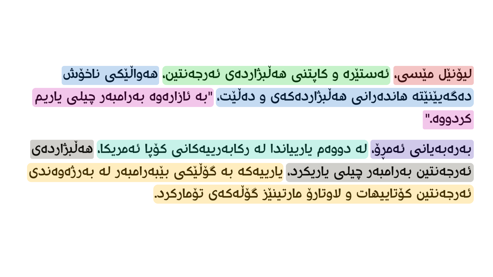

# CkbSentencizer

CkbSentencizer is a Python package designed to convert paragraphs, long texts, or articles into sentences in Central Kurdish (Sorani).

## Installation

You can install CkbSentencizer using pip:

```bash
pip install git+https://github.com/abdulbaseet-zahir/ckb-sentencizer.git
```

## Usage

Here's a basic example of how to use the CkbSentencizer:

```python
from ckb_sentencizer import CkbSentencizer, ARGS

# Initialize the sentencizer
tokenizer = CkbSentencizer(by=list(ARGS.keys()))

# Sample text in Central Kurdish (Sorani) from rudaw.net/sorani/sports/260620241
text = """
لیۆنێل مێسی، ئەستێرە و کاپتنی هەڵبژاردەی ئەرجەنتین، هەواڵێکی ناخۆش دەگەیێنێتە هاندەرانی هەڵبژاردەکەی و دەڵێت، "بە ئازارەوە بەرامبەر چیلی یاریم کردووە".
بەرەبەیانی ئەمڕۆ، لە دووەم یارییاندا لە رکابەرییەکانی کۆپا ئەمریکا، هەڵبژاردەی ئەرجەنتین بەرامبەر چیلی یاریکرد، یارییەکە بە گۆڵێکی بێبەرامبەر لە بەرژەوەندی ئەرجەنتین کۆتاییهات و لاوتارۆ مارتینێز گۆڵەکەی تۆمارکرد.
"""

# Sentencize the articles
sentences = tokenizer.tokenize(text)

# Print the sentencized text
print(sentences)
```
